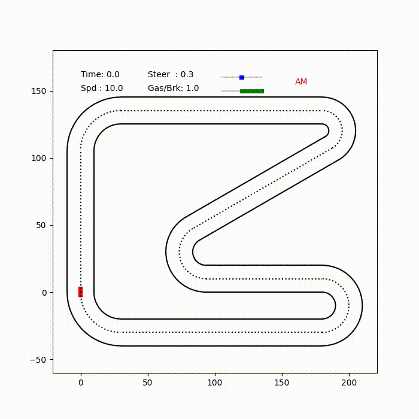
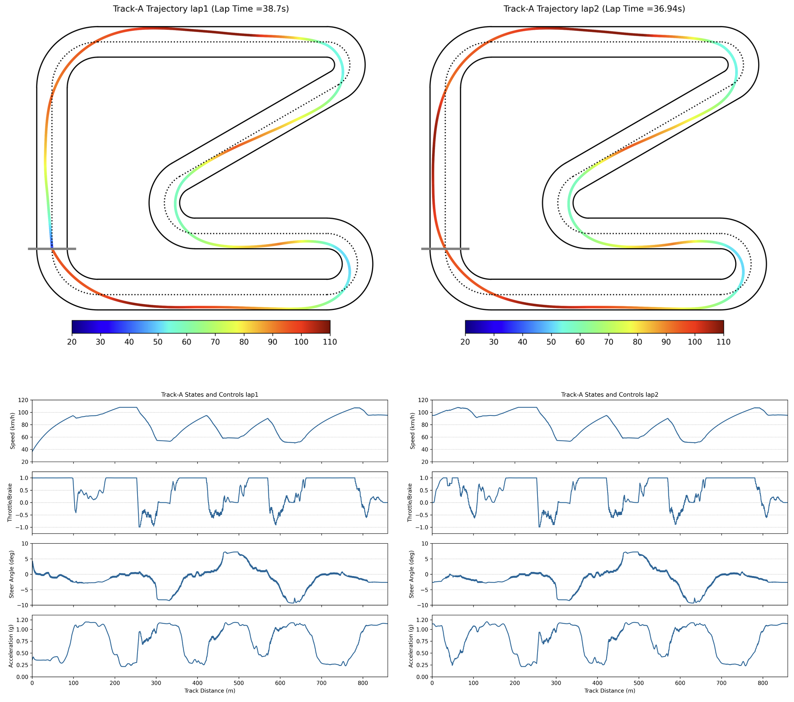

# Autonomous Racing with Action Mapping Reinforcement Learning

This repository contains the code for our research on autonomous racing, as detailed in our paper [Learning autonomous race driving with action mapping reinforcement learning](https://doi.org/10.1016/j.isatra.2024.05.010) [R1]. 

<p align="center">
  
</p>

## Table of Contents

- [Introduction](#introduction)
- [Installation](#installation)
- [Usage](#usage)
- [Results](#results)
- [Future Work](#future-work)
- [Contributing](#contributing)
- [License](#license)
- [Acknowledgments](#acknowledgments)

## Introduction

Autonomous race driving poses a complex control challenge as vehicles must be operated at the edge of their handling limits to reduce lap times while respecting physical and safety constraints. This project presents a novel reinforcement learning (RL)-based approach, incorporating the action mapping (AM) mechanism to manage state-dependent input constraints arising from limited tire-road friction. The AM mechanism is originally proposed by Dr. Xin Yuan in the paper [Action Mapping: A Reinforcement Learning Method for Constrained-Input Systems](https://ieeexplore.ieee.org/document/9681079) [R2]. A numerical approximation method is proposed to implement AM, addressing the complex dynamics associated with the friction constraints. The AM mechanism also allows the learned driving policy to be generalized to different friction conditions. Experimental results in our developed race simulator demonstrate that the proposed AM-RL approach achieves superior lap times and better success rates compared to the conventional RL-based approaches. The generalization capability of driving policy with AM is also validated in the experiments.

In this repository, we provide the implementation of our AM-RL-based autonomous racing algorithm. The code is designed to train and evaluate the performance of the autonomous racing policy in a simulation environment. 
Please refer to our papers for a detailed explanation of the methods and results.

## Installation

### Prerequisites

Ensure you have the following software and libraries installed:

- Python 3.7+
- PyTorch 1.X
- NumPy
- Matplotlib 3.8+
- ffmpeg 4.2+ (to generate the race video)

### Steps

1. Clone the repository:
    ```sh
    git clone https://github.com/agi-brain/Autonomous-Race-with-AM-RL.git
    ```
2. Navigate to the project directory:
    ```sh
    cd Autonomous-Race-with-AM-RL
    ```

## Usage

### Training the AM-RL Driving Policy

To train the autonomous racing model, run the following script:

```sh
python Train_CarRace_TD3AM.py
```
The policy (actor network) will be saved under the `./models/` directory for every 100k training iterations 

### Evaluating the AM-RL Driving Policy 

To evaluate the trained model, use the following script:

```sh
python Run_CarRace_ExampleModel.py
```

In the `./example/model` directory, we provide two example policy models named `model_1776` and `model_1969`. By default settings, the python script will load the example model `model_1969`. 
If you want to evaluate your trained model_XXX from the `./model/` directory, change the path (line 19): `model_path = 'example_model/model_1969` to `model_path = 'models/model_XXX'`

The default evaluation script will generate four figures and one mp4 video clip in the `./results/` directory, which are:

- Trajectory for lap 1 
- Trajectory for lap 2 
- Car data log for lap 1 
- Car data log for lap 2 
- Video for lap 1 and lap 2

<p align="center">
  
</p>

If your trained policy cannot finish at least one lap, the data log for lap 2 will not be given.  

## Results

The saved example model `model_1969` reaches the flying lap time of 36.94s in Track-A

## Future Work

We have several planned features and modules that we aim to integrate into the project in the future:

- Training and evaluation on Track-B (Beijing Ruisi Track). This part will be given soon. 
- Two-car head-to-head competition scenario. 
- Multi-car competition scenario.
- Integration to Xuance 

## Contributing

We welcome contributions from the community. 

## License

This project is licensed under the MIT License. See the [LICENSE](LICENSE) file for details.

## Acknowledgments

We would like to thank [Dr. Wenzhang Liu](https://github.com/wenzhangliu) for his support on open sourcing this project.

This work was supported by National Natural Science Foundation of China [grant numbers 62136008, 62103104, 62203113]; 
the Natural Science Foundation of Jiangsu Province, China [grant number BK20210215].

## Citation

If you find this work useful for your research, please cite our papers:

[R1] Yuanda Wang, Xin Yuan, Changyin Sun. Learning autonomous race driving with action mapping reinforcement learning. ISA Transactions 150:1-14 (2024)

```bibtex
@article{wang2024learning,
title = {Learning autonomous race driving with action mapping reinforcement learning},
journal = {ISA Transactions},
volume = {150},
pages = {1-14},
year = {2024},
doi = {https://doi.org/10.1016/j.isatra.2024.05.010},
url = {https://www.sciencedirect.com/science/article/pii/S0019057824002143},
author = {Yuanda Wang and Xin Yuan and Changyin Sun},
keywords = {Autonomous race driving, Reinforcement learning, Safety constraint, Action mapping}}
```

[R2] Xin Yuan, Yuanda Wang, Jian Liu, Changyin Sun. Action Mapping: A Reinforcement Learning Method for Constrained-Input Systems. IEEE Transactions on Neural Networks and Learning Systems 34(10):7145-7157 (2023)
```bibtex
@ARTICLE{yuan2023action,
  author={Yuan, Xin and Wang, Yuanda and Liu, Jian and Sun, Changyin},
  journal={IEEE Transactions on Neural Networks and Learning Systems}, 
  title={Action Mapping: A Reinforcement Learning Method for Constrained-Input Systems}, 
  year={2023},
  volume={34},
  number={10},
  pages={7145-7157},
  keywords={Optimal control;Cost function;Reinforcement learning;Convergence;Aerospace electronics;TV;System dynamics;Constrained-input systems;neural network;optimal control;reinforcement learning (RL)},
  doi={10.1109/TNNLS.2021.3138924}}
```

Yuanda Wang

Jun. 20, 2024


